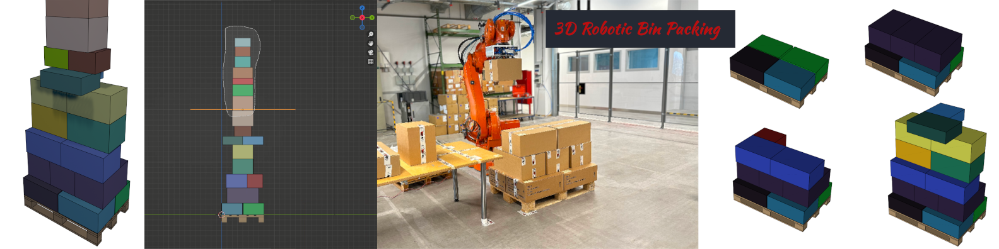
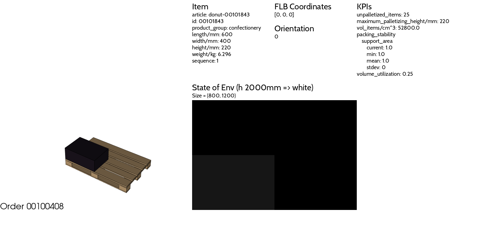
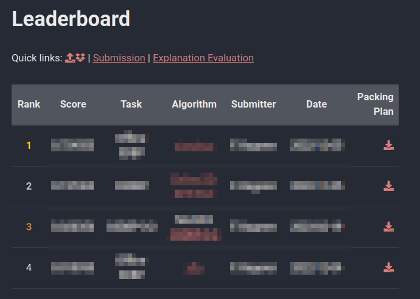

<div align="center">



</div>

---

<div align="center">

# BED-BPP: Benchmark Dataset for Robotic Bin Packing Problems

</div>


<!-- -------------------------------------------------------------- -->
## <div align="center">Paper Accepted</div>
I am happy to announce that our paper "BED-BPP: Benchmarking Dataset for Robotic Bin Packing" has been accepted for publication in the <a href="https://journals.sagepub.com/home/ijr" target="_blank">International Journal of Robotics Research (IJJR)</a>.


Whenever you use the dataset, please cite our publication:

>
> Kagerer F, Beinhofer M, Stricker S, Nüchter A. BED-BPP: Benchmarking dataset for robotic bin packing problems. The International Journal of Robotics Research. 2023;42(11):1007-1014. doi:10.1177/02783649231193048
> <br>
> <a href="https://floriankagerer.github.io/assets/publications/Kagereretal2023-ijrr.bib" target="_blank">[BibTeX]</a>
<a href="https://doi.org/10.1177/02783649231193048" target="_blank">[DOI]</a>
>


<!-- -------------------------------------------------------------- -->
## <div align="center">Getting Started</div>

Please find below the instructions on how to setup and use the code in this repository.

<!-- Preliminaries -->
<details open>
<summary><u>Preliminaries (Python and Blender)</u></summary>

To use all features and functions in this repository, make sure that you have installed Python and Blender on your system.

**Blender.** Download and install [Blender](https://www.blender.org/download/). If [script_evaluate_packing_plan.py](./code/script_evaluate_packing_plan.py) does not find the location of Blender, add the [Blender path to bed-bpp_env.conf](./code/bed-bpp_env.conf#L16).

**Python.** Depending on your system, we suggest to use different Python versions (Take a look for which platform and Python version the [Visualization Toolkit](https://vtk.org/download/) wheels are available.). We suggest to use the environment with

<div align="center">

| Platform              | Python Version |
|-----------------------|----------------|
| macOS (with M1 chip)  | Python >= 3.9  |
| Ubuntu/Linux          | Python >= 3.8  |

</div>

Note, that we will use python3.9 in the following instructions.


</details> <!-- end preliminaries-->
<br>

<!-- Install Requirements -->
<details open>
<summary><u>Install (Requirements in Python venv)</u></summary>

1. Create and activate a virtual Python environment
    
    (a) Check your Python version with
    ```bash
    dev@nb:~$ compgen -c python
    ```
    This command should list all available Python versions.

    <br>

    (b) Create a virtual environment with
    ```bash
    dev@nb:~$ python3.9 -m venv /path/to/venv/bed-bpp
    ```
    > &#x26A0;&#xFE0F; \
    > Change `/path/to/venv/bed-bpp` according to your needs. \
    > Note that you can remove a virtual environment with `sudo rm -rf /path/to/venv/bed-bpp`.
    
    <br>

    (c) Activate the virtual environment with
    ```bash
    dev@nb:~$ source /path/to/venv/bed-bpp/bin/activate
    ```
    Now your terminal should look similar to
    ```bash
    (bed-bpp) dev@nb:~$ 
    ```

    (d) Add the full path to [code/](./code/) to your PYTHONPATH. 


> &#x26A0;&#xFE0F; \
> We added the script [activate_venv.sh](activate_venv.sh) which automatically activates the venv and updates the PYTHONPATH.\
> Just enter your location of the virtual environment in line 2 and run the script with 
> ```bash
> source activate_venv.sh
> ```
> <br> 


<br>

2. Install the required packages

    (a) Upgrade pip with
    ```bash
    (bed-bpp) dev@nb:~$ /full/path/to/venv/bed-bpp/bin/python3 -m pip install --upgrade pip
    ```

    <br>

    (b) Install the requirements with
    ```bash
    (bed-bpp) dev@nb:~$ pip install -r requirements.txt
    ```

<br>

> &#x26A0;&#xFE0F; **Note for Debugging with VS Code.** \
> If you can’t find the Python interpreter of the virtual environment, you might set a venv path in VS Code. To do this, open the settings with `"Ctrl + ,"` and search for `"venv"`. Then, add the folder where your venv is stored to the field `"Python: Venv Path"`.

</details> <!-- end install-->
<br>


<!-- usage -->
<details open>
<summary><u>Usage</u></summary>

Change the current working directory to
```bash
(bed-bpp) dev@nb:~$ cd RepoDir/bed-bpp-env/code/
```
and check whether the setup was successful by running
```bash
(bed-bpp) dev@nb:~/RepoDir/bed-bpp-env/code$ python3 demo_gym_palenv-py -v
```
After a few seconds you should see an image that is similar to the following

<div align="center">



**😀 Happy Coding 😀**
</div>
</details> <!-- end usage-->
<br>

<!-- -------------------------------------------------------------- -->
## <div align="center">Scripts</div>
Here is an overview about the scripts in this repo.

<!-- -->
<details><summary>demo_gym_palenv.py</summary>
This script demonstrates the use of this repository and the palletizing environment. 

</details><br>


<!-- -->
<details><summary>script_evaluate_packing_plan.py</summary>
This script evaluates packing plans and stores the results. 

</details><br>


<!-- -->
<details><summary>run_heuristic_O3DBP_3_2.py</summary>
The script which we used to create the packing plan for the task Online 3D bin packing with preview `p=3` and selection `s=2`.

</details><br>


<!-- -->
<details><summary>script_visualize_packing_plan.py</summary>
This script visualizes a packing plan, which is given as dict with order ids as key and a list of actions as values, and finally creates a video of the palletization for each order.  

</details><br>


<!-- -->
<details><summary>run_your_solver.py</summary>
This script can be used for your solver.
</details><br>


<!-- -------------------------------------------------------------- -->
## <div align="center">Participation</div>

We encourage you to develop solvers for the three-dimensional bin packing problem and submit your results to the [leaderboard](https://floriankagerer.github.io/leaderboard/).

For details, visit https://floriankagerer.github.io/dataset and https://floriankagerer.github.io/leaderboard.

<div align="center">
    


</div>

Till now, we integrated the following solvers in this repo and used `BED-BPP` as benchmark:  

- [alexfrom0815/sisyphus](./alexfrom0815_O3D-BPP-PCT/readme_Online-3D-BPP-PCT_integration.md)

- [floriankagerer/heuristic_O3DBP-3-2](./code/heuristics/O3DBP_3_2.md)

- [hschneid/xflp](./hschneid_xflp/readme_xflp_integration.md)

- [josch/sisyphus](./josch_sisyphus/readme_sisyphus_integration.md)


